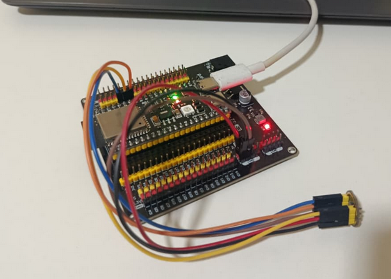

# esp32s3-audio-capture

Código para **ESP32-S3** que captura áudio do microfone **INMP441** e envia as amostras via terminal para o **Edge Impulse Data Forwarder**, para coleta de dados de treino de **tinyML**.

<div align="center">
  
</div>

## Instalação do Edge Impulse CLI

Requer Node.js 20 ou superior.

```bash
npm install -g edge-impulse-cli
```
## Como usar

1. Grave o código na placa.
2. Rode o Data Forwarder, usando **o mesmo baud rate**:
```bash
   edge-impulse-data-forwarder --clean --baud-rate 2000000 --frequency 16000
```
3. Informe usuário e senha do Edge Impulse e dê o nome `audio` ao eixo detectado.
4. No Studio, vá em **Data acquisition**, escolha o dispositivo, defina o label e a duração e inicie a captura.
